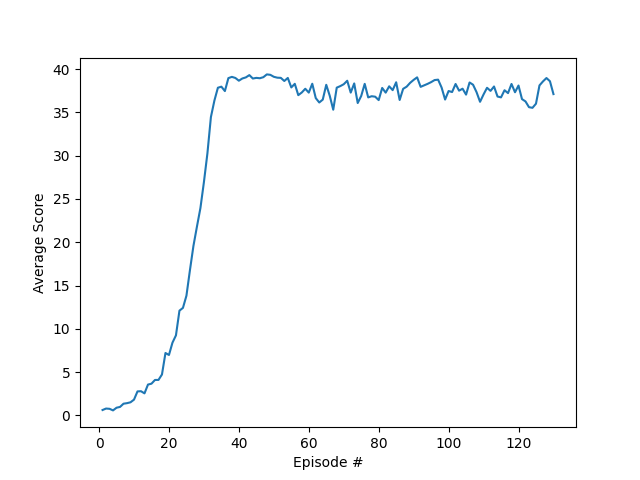

# Report
The project involved training a double-jointed arm to move to target locations. A reward of +0.1 is provided for each step that the agent's hand is in the goal location. The goal of the agent is to maintain its position at the target location for as many time steps as possible. The environment is considered solved, when the average (over 100 episodes) of those average scores is at least +30. 

Description of the files in the repository:
| File | Description |
| --- | --- |
| `train.py` | The script used to train the agent |
| `run.py` | The script used to run the trained agent |
| `ddpg_agent.py` | The implementation of the DDPG agent class |
| `model.py` | The implementation of the Actor and Critic neural networks |
| `checkpoint_actor.pth` | The trained actor network weights |
| `checkpoint_critic.pth` | The trained critic network weights |

## Learning Algorithm
In this project we are required to solve a problem with a continuous action space. DDPG, or Deep Deterministic Policy Gradient, is a reinforcement learning algorithm that combines ideas from deep learning and policy gradients. DDPG is an off-policy actor-critic algorithm that is well-suited for problems with continuous action spaces, and has been successfully applied to robotic control problems. It was first described in [this paper](https://arxiv.org/pdf/1509.02971.pdf) by researchers at Google DeepMind.

Here's a breakdown of the key components and concepts of DDPG used in this project:

1. **Actor-Critic Architecture:**
   - DDPG employs an actor-critic architecture, which means it has two neural networks working in tandem: an actor and a critic. 
   - **The Actor**:
     - The actor is responsible for learning the optimal policy, mapping states to actions. The actor network outputs a **deterministic** action for a given state. This is useful in continuous action spaces where selecting a specific action from a distribution may be impractical.
     - Network Architecture:
       - The actor network consists of 3 fully connected layers with 400, 300 and 4 nodes respectively. 
       - The input to the network is the state vector of size 33 - the observation space size.
       - The first two layers are followed by a **ReLU** activation function.
       - The final layer is followed by a **tanh** activation function, because the action space is continuous between -1 and 1.
  
        The code for the actor network is as follows:

        ```python
        class Actor(nn.Module):
        """Actor (Policy) Model."""

            def __init__(self, state_size, action_size, seed, fc1_units=400, fc2_units=300):
                """Initialize parameters and build model.
                Params
                ======
                    state_size (int): Dimension of each state
                    action_size (int): Dimension of each action
                    seed (int): Random seed
                    fc1_units (int): Number of nodes in first hidden layer
                    fc2_units (int): Number of nodes in second hidden layer
                """
                super(Actor, self).__init__()
                self.seed = torch.manual_seed(seed)
                self.fc1 = nn.Linear(state_size, fc1_units)
                self.fc2 = nn.Linear(fc1_units, fc2_units)
                self.fc3 = nn.Linear(fc2_units, action_size)
                self.reset_parameters()

            def reset_parameters(self):
                self.fc1.weight.data.uniform_(*hidden_init(self.fc1))
                self.fc2.weight.data.uniform_(*hidden_init(self.fc2))
                self.fc3.weight.data.uniform_(-3e-3, 3e-3)

            def forward(self, state):
                """Build an actor (policy) network that maps states -> actions."""
                x = F.relu(self.fc1(state))
                x = F.relu(self.fc2(x))
                return F.tanh(self.fc3(x))
        ```
        
    - **The Critic**:     
        - The critic evaluates the actions chosen by the actor by estimating the expected cumulative reward from a given state-action pair. It helps the actor to learn which actions are more likely to lead to higher rewards.
   
        - Network Architecture:
            - The input to the critic network consists is the observation space size (33) at the first fully connected layer with 400 nodes.
            - The input to the second fully connected layer is the action size (4) and the output of the first layer (400).
            - The third full connected layer consists of 300 nodes, and outputs a single value (Q-value).
  
        ```python
        class Critic(nn.Module):
            """Critic (Value) Model."""

            def __init__(self, state_size, action_size, seed, fcs1_units=400, fc2_units=300):
                """Initialize parameters and build model.
                Params
                ======
                    state_size (int): Dimension of each state
                    action_size (int): Dimension of each action
                    seed (int): Random seed
                    fcs1_units (int): Number of nodes in the first hidden layer
                    fc2_units (int): Number of nodes in the second hidden layer
                """
                super(Critic, self).__init__()
                self.seed = torch.manual_seed(seed)
                self.fcs1 = nn.Linear(state_size, fcs1_units)
                self.fc2 = nn.Linear(fcs1_units+action_size, fc2_units)
                self.fc3 = nn.Linear(fc2_units, 1)
                self.reset_parameters()

            def reset_parameters(self):
                self.fcs1.weight.data.uniform_(*hidden_init(self.fcs1))
                self.fc2.weight.data.uniform_(*hidden_init(self.fc2))
                self.fc3.weight.data.uniform_(-3e-3, 3e-3)

            def forward(self, state, action):
                """Build a critic (value) network that maps (state, action) pairs -> Q-values."""
                xs = F.relu(self.fcs1(state))
                x = torch.cat((xs, action), dim=1)
                x = F.relu(self.fc2(x))
                return self.fc3(x)
                ```

2. **Experience Replay:**
   - DDPG uses experience replay to break the temporal correlations in the data and improve the stability of learning. It stores past experiences (tuples of state, action, reward, next state) in a replay buffer and randomly samples from it during the training process. 
   - The implementation of the replay buffer is found in the `ddpg_agent.py` file, in the `ReplayBuffer` class.
 
3. **Target Networks:**
   - To stabilize the training, DDPG uses two sets of networks for both the actor and the critic: target networks and online networks.
   - The target networks are slowly updated with the parameters of the online networks through a soft update mechanism. This helps in maintaining a more stable and slowly changing target for the learning process. The soft update is implemented in the `ddpg_agent.py` file, in the `soft_update` function of the `Agent` class.

4. **Ornstein-Uhlenbeck Noise:**
   - Since DDPG is designed for continuous action spaces, exploration is essential. Ornstein-Uhlenbeck noise is added to the actions output by the actor during training to encourage exploration. 
   - **Adding noise to the training process was found to be very important for the success of the training process.** The noise was added such that the entire action space is explored [-1,1]. The implementation of the noise is found in the `ddpg_agent.py` file, in the `OUNoise` class.

## HYPERPARAMETERS

```python
BUFFER_SIZE = int(1e5)  # replay buffer size
BATCH_SIZE = 128        # minibatch size
GAMMA = 0.99            # discount factor
TAU = 1e-3              # for soft update of target parameters
LR_ACTOR = 1e-4         # learning rate of the actor 
LR_CRITIC = 1e-4        # learning rate of the critic
WEIGHT_DECAY = 0        # L2 weight decay
```

## Training Result

The following plot describes the average reward during training progress.

```bash
Environment solved in 30 episodes!      Average Score: 37.67
```


## Ideas for Future Work
Some ways to improve the training process could be:
1. Try out different actor-critic methods such as [A3C](https://arxiv.org/pdf/1602.01783.pdf), [PPO](https://arxiv.org/pdf/1707.06347.pdf), [D4PG](https://openreview.net/pdf?id=SyZipzbCb).
2. Use prioritized experience replay.